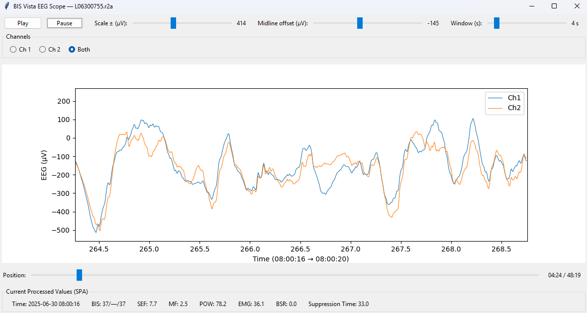

# BIS Vista EEG Scope (Python)

A lightweight viewer for BIS Vista USB studies. It reads two‑channel EEG from `.r2a`, converts to microvolts, and displays a scrolling oscilloscope‑style plot with live processed values from the matching `.spa` file.

> If you want to use the GitHub web interface only, follow the **GitHub Web Upload** section below.

---

## Table of contents
- [Features](#features)
- [Screenshots](#screenshots)
- [Installation](#installation)
- [Usage](#usage)
  - [Typical workflow](#typical-workflow)
  - [Controls](#controls)
- [Data assumptions](#data-assumptions)
  - [SPA column mapping](#spa-column-mapping)
  - [Parsing and cleaning rules](#parsing-and-cleaning-rules)
  - [Time alignment](#time-alignment)
- [Configuration](#configuration)
- [Troubleshooting](#troubleshooting)
- [FAQ](#faq)
- [GitHub Web Upload](#github-web-upload)
- [Contributing](#contributing)
- [License](#license)
- [Acknowledgements](#acknowledgements)
- [Citation](#citation)

---

## Features
- Real‑time playback at 1 second per second with **Play** and **Pause**.
- Adjustable fixed scale from **10** to **1000 µV**. No autoscale.
- **Midline offset** control to shift the zero line up or down.
- Time slider to scrub through the file.
- Channel toggle: **Ch 1**, **Ch 2**, or **Both**.
- Auto‑detect `.r2a` files in the current folder. If more than one, pick from a prompt.
- Load matching `.spa` with the same stem if present. If missing, continue without SPA values.
- Live display of **BIS** triplet, **SEF**, **MF** (median frequency), **POW**, **EMG**, **BSR**, **Suppression Time**.
- Optional SPA console summary.

## Screenshots


---

## Installation

Python 3.9 or newer is recommended.

```bash
pip install -r requirements.txt
```

> **Linux note:** Tkinter is needed for the GUI.
> Ubuntu example:
> ```bash
> sudo apt-get install python3-tk
> ```

---

## Usage

### Typical workflow
1. Open a terminal **in your study folder** that contains one or more `.r2a` files.
2. Run:
   ```bash
   python bis_scope.py
   ```
   If more than one `.r2a` is present you will be asked to select a file. The script searches for a matching `.spa` with the same stem. If not found, it proceeds without SPA values.

You can also pass a directory or a direct `.r2a` path:
```bash
python bis_scope.py "F:\Dropbox\TCI\Neuromonitoring\BIS VSC\BIS2DSA Code\L07180907"
python bis_scope.py "F:\path\to\file.r2a"
```

### Controls
- **Scale ± (µV):** sets the half‑range. Example: scale 200 and offset 0 gives y‑axis −200 to +200 µV.
- **Midline offset (µV):** shifts the center. Example: scale 200 and offset +100 gives y‑axis −100 to +300 µV.
- **Window (s):** sets the visible time window.
- **Position:** bottom slider to jump anywhere in the recording.
- **Channels:** choose Ch 1, Ch 2, or Both.

---

## Data assumptions

- EEG in `.r2a` is interleaved **signed 16‑bit**, two channels, **128 Hz**.
- Microvolt scaling constant: `1675.42688 / 32767` (about `0.0511 µV` per step).
- SPA is pipe‑delimited with **two header lines**, then one row per second.

### SPA column mapping
Indices are 0‑based (Python). These match the layout used in Connor (2022) and the additions requested.

| Field | Python index | Notes |
|------|--------------:|------|
| Timestamp `t` | 0 | first column |
| BIS triplet | 11, 25, 39 | displayed as `BIS: a/b/c` |
| SEF | 36 | Hz |
| MF (median frequency) | 37 | Hz |
| POW | 42 | unit as exported |
| EMG | 43 | unit as exported |
| BSR | 35 | burst suppression ratio |
| Suppression Time | 48 | seconds or as exported |

If your SPA layout differs, edit the indices in `parse_spa_with_headers`.

### Parsing and cleaning rules
- Values are parsed as `float`. Any **negative** is treated as **missing** and converted to `NaN`.
- Display shows `—` for missing values.

### Time alignment
- SPA is 1 Hz. R2A is 128 Hz.
- The status panel selects index `sec = int(current_t)` so the summary and the plotted window stay aligned.
- If the first SPA timestamp is parseable as an absolute datetime, the x‑axis shows absolute time for the current window.

---

## Configuration

At the top of `bis_scope.py`:

```python
FS_EEG = 128.0               # sample rate in Hz
UV_PER_STEP = 1675.42688 / 32767.0
DEFAULT_WINDOW_S = 10.0
SHOW_SPA_SUMMARY = True      # print SPA column list and a quick snapshot in the console
```

Set `SHOW_SPA_SUMMARY = False` if you want a quiet launch.

---

## Troubleshooting

- **Windows path quoting:** paths with spaces must be quoted. Example: `"F:\path with spaces\L07180907"`.
- **Tkinter missing on Linux:** install `python3-tk` with your package manager.
- **No .r2a found:** open the terminal in the folder that actually contains the `.r2a` files, or pass a directory path to the script.
- **SPA looks off:** column positions may differ between exports. Adjust the indices in `parse_spa_with_headers` or contact the maintainer.
- BIS does regular ground checks. They look like flat EEG in the file but are artefact, not burst suppression. Verify with BSR and ST before concluding that suppression is present.

---

## FAQ

**Does this autoscale the y‑axis?**  
No. Scale is fixed. You can adjust the half‑range and the midline offset.

**Can I run it without an SPA?**  
Yes. The tool works with `.r2a` only. The status panel will show SPA values as unavailable.

**Can you map SPA columns by header name automatically?**  
Possible. Open an issue. A header‑driven parser can look for common labels and fall back to indices.

---

## Contributing
Issues and pull requests are welcome. Please:
- Describe the dataset layout that caused trouble.
- Include Python version and OS.
- Share a redacted SPA header line if the mapping seems different.

---

## License
MIT. See [LICENSE](LICENSE).

---

## Acknowledgements
The SPA column mapping and microvolt scaling are informed by Connor (2022), *Emulation of the BIS Engine*, Table 3.
Connor CW. Emulation of the BIS engine. J Clin Monit Comput. 2022 Apr;36(2):483-492. doi: 10.1007/s10877-021-00676-2. Epub 2021 Mar 19. PMID: 33742345; PMCID: PMC8449791.

## Citation
If this tool helps your work, you can cite it as:
> Coetzee E. BIS Vista EEG Scope (Python). GitHub. 2025. https://github.com/<your-user>/bis-vista-eeg-scope
